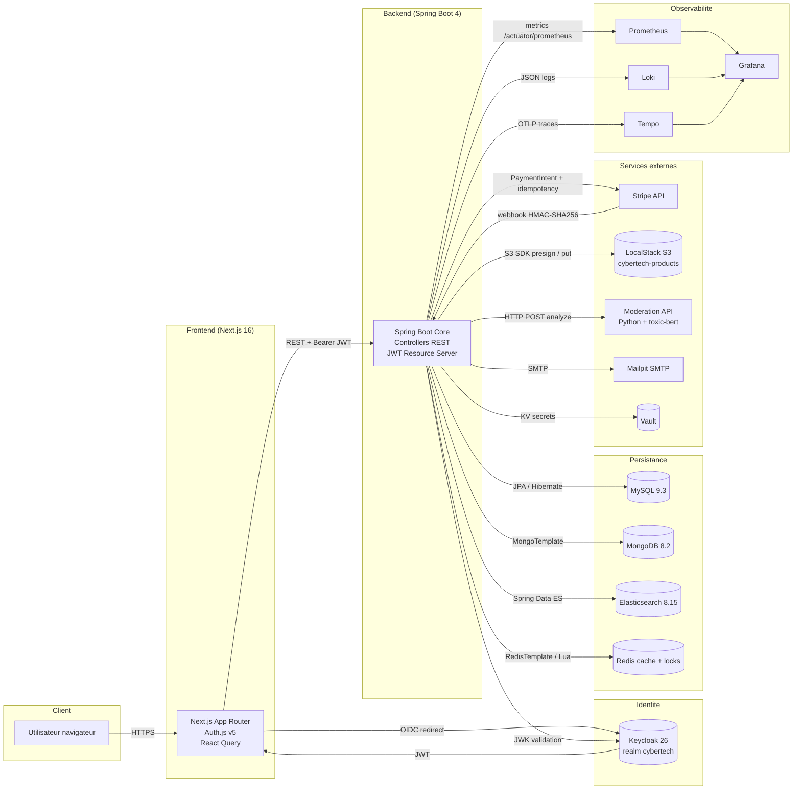
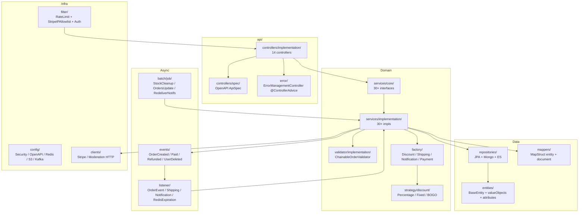
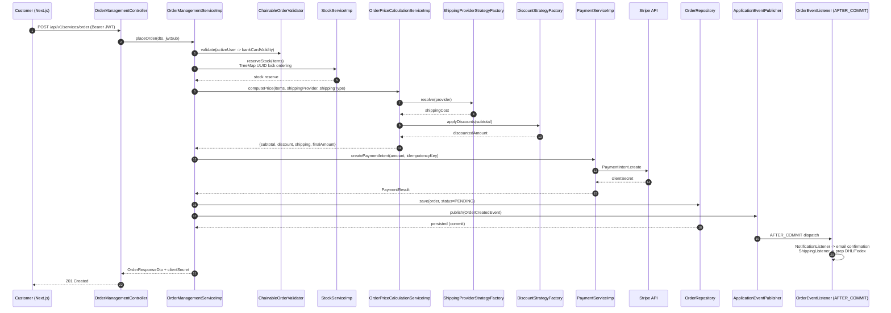
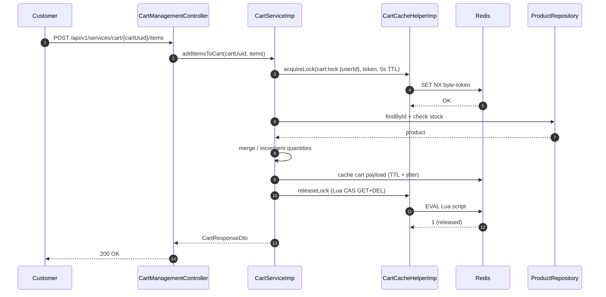
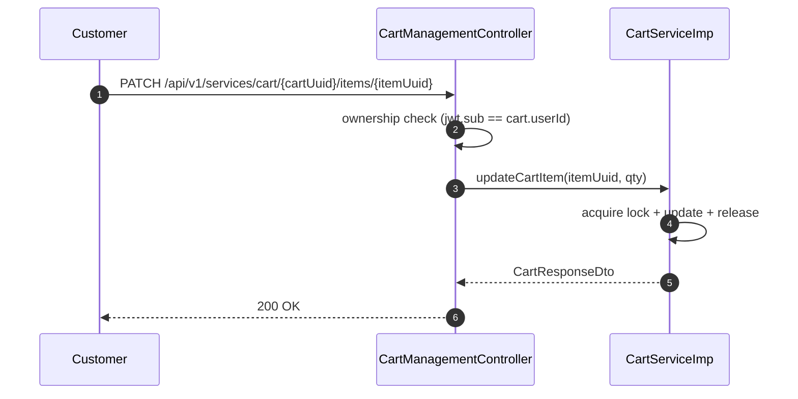
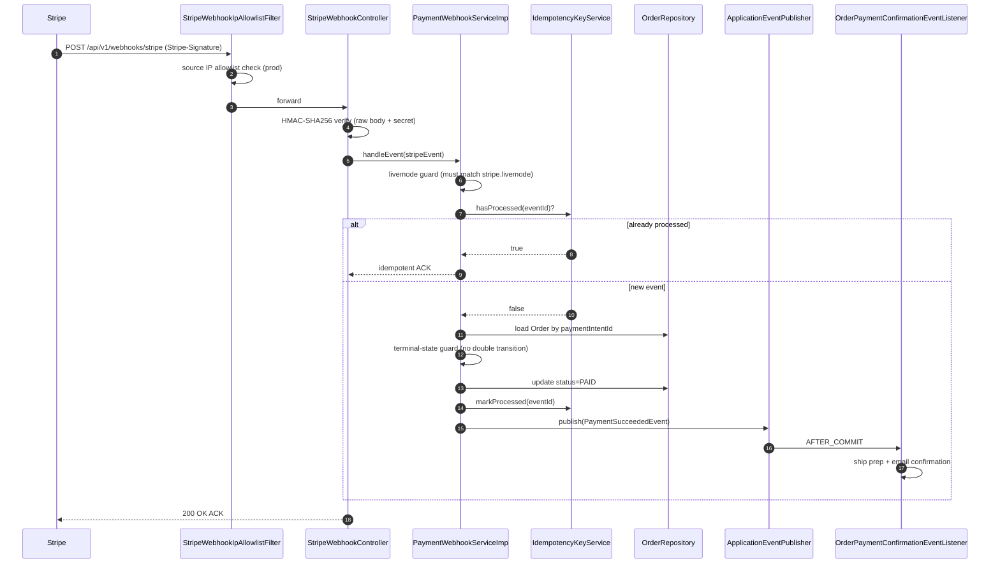
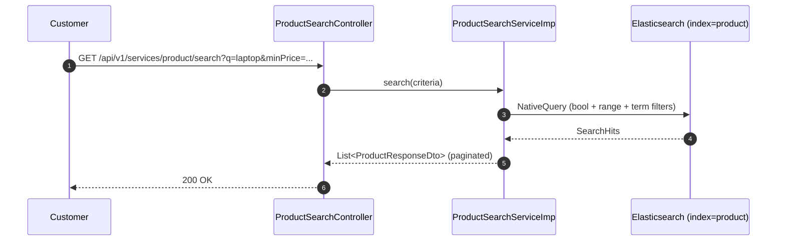
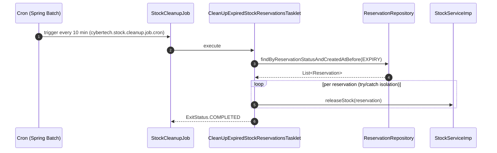
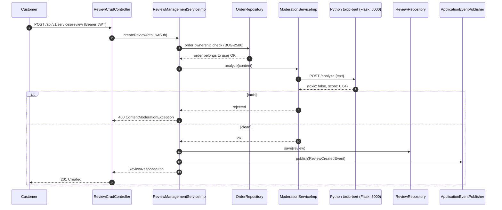

# Cybertech — Plateforme E-Commerce

[](#stack-technique)
[](#stack-technique)
[](#stack-technique)
[](#tests)
[](#tests)

---

## Vue d'ensemble

Cybertech est un **backend Spring Boot 4 + frontend Next.js 16** pour une plateforme e-commerce dédiée aux produits informatiques (ordinateurs portables, écrans, smartphones, claviers). La plateforme couvre l'intégralité du parcours client — découverte du catalogue, panier, wishlist, paiement Stripe, livraison, notifications email, reviews modérées — et la totalité de l'arrière-boutique : gestion produits, utilisateurs, commandes, campagnes promotionnelles.

L'architecture est un **monolithe modulaire** organisé en couches (controller → service → repository) avec une séparation par domaine fonctionnel. Les ruptures de charge ont été placées là où elles comptent : **Elasticsearch** pour la recherche, **Redis** pour le cache panier et les locks distribués, **MongoDB** pour les events utilisateur, **Keycloak** pour l'identité, **Stripe** pour le paiement, **LocalStack S3** pour les images. Les flux asynchrones critiques (notifications, expédition, ré-indexation ES) passent par `ApplicationEventPublisher` + `@TransactionalEventListener(AFTER_COMMIT)` pour garantir la cohérence transactionnelle, et un service Python externe basé sur **toxic-bert** modère le contenu des reviews.

Le projet est **observable** (Prometheus + Loki + Tempo + Grafana en cluster), **testé** (1 681 tests unitaires + Testcontainers ITs + ArchUnit + JaCoCo gate 80 %), **déployable** (Helm charts pour 16 services, Skaffold, Jib, ingress NGINX), et **load-testable** (Gatling 3 avec trois scénarios pré-écrits). Il est dimensionné pour tourner sur **minikube** en projet portfolio mais reste l'expression complète d'un produit prêt pour la production.

---

## Domaines fonctionnels couverts

| Domaine | Description |
|---|---|
| **Catalogue produit** | Catégories typées (laptop / smartphone / monitor / keyboard) avec attributs spécifiques par catégorie via `ProductAttributesFactory`, gestion brand / stock / images S3, indexation Elasticsearch automatique. |
| **Recherche** | Endpoint `ProductSearchController` adossé à un index Elasticsearch 8.15.3 avec filtres prix / catégorie / brand / attributs. Re-index sur événement domaine. |
| **Panier** | `CartManagementController` + cache Redis, **lock distribué Redis Lua-CAS** pour la concurrence d'accès, retry-once sur `DataIntegrityViolation`, contrainte `UNIQUE(userId)` côté DB pour empêcher les doublons. |
| **Wishlist** | `WishlistManagementController` — gestion par utilisateur, ajout/suppression idempotente. |
| **Commande** | Cycle complet : `placeOrder` → `updateOrder` → `cancelOrder` → `retryPayment`. Validation chaînée (`ChainableOrderValidator`), réservation de stock avec **lock ordering canonique** (`TreeMap<UUID>`) anti-deadlock, calcul de prix consolidé avec discount + shipping. |
| **Paiement Stripe** | PaymentIntent + clés idempotency, **webhook HMAC-SHA256** + ledger d'idempotency + guard `livemode`, retry Resilience4j sur l'API Stripe avec circuit breaker. |
| **Livraison** | `ShippingProviderStrategyFactory` (DHL, FedEx) consommée par `OrderPriceCalculationService` pour intégrer le coût de port au prix final, et par `ShippingListener` (AFTER_COMMIT) pour orchestrer l'expédition après paiement. |
| **Discounts / promotions** | Pattern Strategy avec `PercentageDiscountStrategy`, `FixedAmountDiscountStrategy`, `BuyOneGetOneFreeDiscountStrategy`. Campagnes pilotables en BDD (admin endpoint). |
| **Reviews & modération** | `ReviewCrudController` ; chaque review passe par un appel HTTP à l'API Python `toxic-bert` (Flask) — refus si toxique, sinon sauvegarde + event domaine. Ownership-check sur `orderUuid`. |
| **Utilisateurs & Keycloak** | Saga DB ↔ Keycloak via `UserPersistenceService` (REQUIRES_NEW) + event `UserDeletedEvent` AFTER_COMMIT pour propager la suppression. Pas de mot de passe en BDD. |
| **Cartes bancaires** | Stockage **AES-256/GCM** avec IV unique par enregistrement (`AesCardEncryptionService`), validation expiry + Luhn, gestion `defaultCard`, conformité PCI-DSS partielle (1 carte / utilisateur en modèle actuel). |
| **Notifications** | Spring Mail + templates Thymeleaf, dispatcher canaux (email / SMS), retry Resilience4j 3 tentatives + table `notificationTable` PENDING_RETRY → batch de redélivrance, **Mailpit** en dev. |
| **Stock** | Réservation pessimiste, libération automatique sur `PaymentFailed`, batch `StockCleanupJob` pour les réservations orphelines, ordering canonique pour empêcher les deadlocks multi-produits. |
| **Events utilisateur** | Persistance MongoDB des événements analytics (`UserEventService`). |
| **Réservations / batch** | Spring Batch : `CybertechOrdersUpdateJob` (cancel pending after N days, ship paid orders), `StockCleanupJob`, `RedeliverFailedNotificationsJob`. |
| **Admin** | Dashboard, gestion produits / users / orders / discounts. Endpoints `/api/v1/services/admin/...` protégés par `hasRole('ADMIN')`. |

---

## Stack technique

### Back-end

| Catégorie | Composant | Version |
|---|---|---|
| Langage | Java | **26** (preview features, `--enable-preview`) |
| Framework | Spring Boot | **4.0.4** |
| Cloud | Spring Cloud | **2025.1.1** |
| Build | Maven (wrapper `./mvnw`) | parent 4.0.4 |
| Mapping | MapStruct | 1.6.3 |
| Boilerplate | Lombok | 1.18.38 |
| ORM utils | Hypersistence Utils | 3.15.2 |
| HTTP doc | springdoc-openapi | 3.0.1 |
| JWT lib | jjwt | 0.12.6 |
| Resilience | Resilience4j (Spring Cloud) | géré par BOM |
| Rate limit | Bucket4j core + Caffeine | 8.10.1 / 3.2.0 |
| AWS | spring-cloud-aws-starter-s3 | 4.0.0 |
| Stripe | stripe-java | **31.4.0** |
| Keycloak | keycloak-admin-client | **26.0.4** |
| MySQL driver | mysql-connector-j | 9.4.0 |
| UUID | uuid-creator (f4b6a3) | 6.1.1 |
| Observabilité | micrometer-registry-prometheus, micrometer-tracing-bridge-otel, opentelemetry-exporter-otlp, logstash-logback-encoder | BOM / 8.0 |

### Front-end

| Composant | Version |
|---|---|
| Next.js | **16.2.4** (app router, `output: standalone`) |
| React | 19.2.4 |
| Auth.js (NextAuth) | 5.0.0-beta.31 (provider Keycloak) |
| TanStack React Query | 5.100.1 |
| Zod | 4.3.6 |
| Tailwind CSS | 4 (`@tailwindcss/postcss`) |
| TypeScript | 5 |
| Node runtime cible | 22-alpine |

### Persistance

| Store | Version | Rôle |
|---|---|---|
| **MySQL** | 9.3 (dev) / 8.4 (helm) | Base relationnelle principale (users, products, orders, payments, bank cards, discount campaigns, notifications). |
| **MongoDB** | 8.2.5 | Events analytiques utilisateur (`userEventsDB`). |
| **Elasticsearch** | **8.15.3** | Index `product` pour la recherche full-text. |
| **Redis** | latest | Cache panier, locks distribués (Lua-CAS), keyspace notifications, TTL jitter. |
| **H2** | embedded | Fallback tests slice (`@WebMvcTest`). |

### Sécurité / Auth

- **Keycloak 26.0.4** — OAuth2 / OIDC (realm `cybertech`, theme custom Material 3)
- **Spring Security** — `KeycloakRoleConverter` + Resource Server JWT
- **HashiCorp Vault** 1.21.4 — secrets (config opt-in)
- **AES-256/GCM** — chiffrement at-rest des PAN bancaires (IV/record, clé via Vault en prod)
- **Bucket4j** — rate-limit `/register`, `/order`, `/cart` (token bucket en mémoire + Caffeine)
- **Stripe webhook** — HMAC-SHA256 + IP allowlist filter
- **CORS / HSTS / CSP** report-only / X-Frame-Options DENY / Permissions-Policy

### Externes / Tooling

| Outil | Rôle |
|---|---|
| **Stripe CLI** v1.37.1 | Forward des webhooks vers le backend en dev |
| **LocalStack** 4.13.1 | Émulateur S3 pour les images produit |
| **Mailpit** | Serveur SMTP dev + UI de revue des emails |
| **Moderation API** (Flask + `unitary/toxic-bert`) | Modération NLP des reviews, exposée sur :5000 |
| **Gorse** | Moteur de recommandations (dev only) |

### Test

- **JUnit 5** + **Mockito** + **AssertJ** + **MockMvc**
- **Testcontainers** 1.21.4 (MySQL, Redis, Mongo, ES, Kafka) pour les `*IT.java` Failsafe
- **Spring Cloud Contract Stub Runner**, **spring-batch-test**, **spring-restdocs-mockmvc**
- **JaCoCo** 0.8.14 — gate `BUNDLE` 80 % line + branch, `haltOnFailure=true`
- **ArchUnit** 1.4.1 — assertions architecturales
- **Datafaker** 2.5.3 — génération de fixtures
- **Gatling** 3.13.5 — 3 simulations (browse-to-order, flash sale, webhook firehose)

### Infrastructure & DevOps

| Outil | Rôle |
|---|---|
| **Docker Compose** | Stack locale (`src/main/resources/docker/docker-compose.yml`) |
| **Helm** | 16 charts (`src/main/resources/k8s/helm/charts/`) |
| **Skaffold** | Boucle dev k8s |
| **Jib** | Build OCI sans Dockerfile |
| **Jenkins** + Docker registry | CI/CD self-hosted (`docker-compose.jenkins.yml`) |
| **GitHub Actions** | Build / test / Qodana |
| **Ingress NGINX** | `cybertech.local` (front) + `api.cybertech.local` (back) + `keycloak.cybertech.local` + `grafana.cybertech.local` |
| **Prometheus / Loki / Tempo / Grafana** | Observabilité full-stack en cluster |

---

## Architecture

### Diagramme général



### Couches du back-end



---

## Flux fonctionnels critiques

### 1. Passage d'une commande



### 2. Ajout d'un produit au panier



### 3. Mise à jour d'une ligne de panier



### 4. Webhook Stripe — paiement réussi



### 5. Recherche produit Elasticsearch



### 6. Job batch — nettoyage des réservations



### 7. Modération d'une review



---

## Démarrage du projet

### Prérequis

- **Java 26** (préférablement Eclipse Temurin 26.0.1 ; preview features activées par `pom.xml`)
- **Node.js 22** + npm
- **Docker Desktop** ou **Docker Engine** + Docker Compose
- **Python 3.10+** si tu veux lancer la moderation API hors conteneur
- (optionnel) **minikube + helm + helmfile** pour le déploiement Kubernetes
- (optionnel) **Stripe CLI** pour forward les webhooks de test

### Lancement local — back-end

```bash
# 1) Démarrer toute l'infra (MySQL, MongoDB, ES, Redis, Keycloak, Vault, LocalStack, Mailpit, Gorse, Stripe CLI, moderation-api)
cd src/main/resources/docker
docker compose up -d

# 2) Compiler et lancer Spring Boot (profil dev par défaut)
cd ../../../..
./mvnw spring-boot:run
```

L'application démarre sur `http://localhost:8081` (profil `dev`, voir `application.properties:9`).

### Lancement local — front-end

```bash
cd front/app
cp .env.local.example .env.local
# Éditer .env.local : générer AUTH_SECRET avec `npx auth secret`
# Récupérer AUTH_KEYCLOAK_SECRET dans le realm cybertech (admin Keycloak http://localhost:8080)
npm install
npm run dev
```

Le front démarre sur `http://localhost:3000`.

### Lancement local — moderation API (Python)

Le service est conteneurisé dans `docker-compose.yml`. Pour le lancer en standalone (debug) :

```bash
cd src/main/java/com/novatech/cybertech/api/external/moderation
pip install -r requirements.txt
python app.py    # Flask sur :5000, charge unitary/toxic-bert (~600 MB RAM)
```

### Variables d'environnement importantes

| Nom | Rôle | Exemple |
|---|---|---|
| `SPRING_PROFILES_ACTIVE` | Profil Spring (`dev`, `test`, `prod`) | `dev` |
| `STRIPE_API_KEY` | Clé secrète Stripe (test ou live) | `sk_test_...` |
| `STRIPE_WEBHOOK_SECRET` | HMAC secret pour vérifier les webhooks | `whsec_...` |
| `APP_CARD_ENCRYPTION_KEY` | Clé AES-256 base64 (32 bytes) pour chiffrer les PAN | `AAEC...` (placeholder dev) |
| `KEYCLOAK_CLIENT_SECRET` | Secret du client `cybertech-user-management-client` | géré par Vault en prod |
| `MYSQL_PORT` | Port MySQL exposé | `3306` |
| `NEXT_PUBLIC_API_BASE` | URL backend lue côté front | `http://localhost:8081` |
| `AUTH_SECRET` | Secret Auth.js | `openssl rand -base64 32` |
| `AUTH_URL` | URL publique du front | `http://localhost:3000` |
| `AUTH_KEYCLOAK_ISSUER` | Issuer OIDC | `http://localhost:8080/realms/cybertech` |
| `AUTH_KEYCLOAK_ID` | client_id Keycloak côté front | `cybertech-frontend` |
| `AUTH_KEYCLOAK_SECRET` | client_secret Keycloak | (configuré dans Keycloak) |

### URLs locales par défaut

| Service | URL |
|---|---|
| Back-end | http://localhost:8081 |
| Swagger UI | http://localhost:8081/swagger-ui.html |
| OpenAPI YAML | http://localhost:8081/v3/api-docs.yaml |
| Front | http://localhost:3000 |
| Keycloak admin | http://localhost:8080 (admin / admin en dev) |
| Mailpit UI | http://localhost:8025 |
| MongoDB | mongodb://localhost:27017 |
| Elasticsearch | http://localhost:9200 |
| Redis | redis://localhost:6379 |
| LocalStack S3 | http://localhost:4566 |
| Vault | http://localhost:8200 (token `root` en dev) |
| Moderation API | http://localhost:5000/analyze |
| Stripe CLI | forward → http://host.docker.internal:8081/api/v1/webhooks/stripe |
| Gorse | http://localhost:8088 |

### Profils Spring

| Profil | Activation | Effet |
|---|---|---|
| `dev` | défaut (`spring.profiles.active=dev`) | H2 console activée, Vault désactivé, HSTS off, Stripe IP allowlist off |
| `test` | `@ActiveProfiles("test")` | Stubs + H2 fallback pour les tests slice |
| `integration-test` | `mvn -Pintegration-test` | Active Failsafe + JaCoCo gate (`*IT.java`) |
| `prod` | `application-prod.properties` | DNS in-cluster, Vault on, HSTS on, Stripe IP allowlist on |
| `loadtest` | `mvn -Ploadtest gatling:test` | Active gatling-maven-plugin |

---

## Tests

```bash
# Tests unitaires (Surefire) + JaCoCo report
./mvnw test                             # 1681 tests, ~3 min sur JDK 26

# Tests d'intégration Testcontainers (Failsafe) + JaCoCo gate 80%
./mvnw verify -Pintegration-test        # +51 ITs, ~10 min

# Régénérer le contrat OpenAPI statique
./mvnw -Dskip=false springdoc-openapi:generate

# Charge Gatling (3 simulations)
./mvnw gatling:test -Ploadtest \
    -Dgatling.simulationClass=com.novatech.cybertech.gatling.BrowseToOrderSimulation \
    -Dgatling.baseUrl=https://staging.api.cybertech.local \
    -Dauth.token=$(./scripts/get-keycloak-token.sh)
```

**Couverture** — JaCoCo gate `BUNDLE` 80 % line + branch (`haltOnFailure=true`). Mesure actuelle : **92,48 % line / 91,19 % branch**. Exclusions : DTO, value objects, enums, mappers générés, config, controllers `*ApiSpec`.

**Stratégies de test**
- **Controllers** : `@WebMvcTest` + `TestSecurityConfig` + `@MockitoBean` + MockMvc + `JwtTestUtils` + JSON STRICT (pattern `ReviewCrudControllerTest`)
- **Services** : `@ExtendWith(MockitoExtension.class)` + `@Mock` + `@InjectMocks`, pas de Spring context
- **ITs** : `*IT.java` Failsafe + `@SpringBootTest` + `@Testcontainers` (MySQL, Redis, Mongo, ES, Kafka)
- **Bug-pinning** : `@Disabled("BUG-xxx")` sur le contrat correct + companion test passant qui pinne le comportement cassé
- **Fixtures partagées** : `src/test/java/com/novatech/cybertech/fixtures/{builders,dto,assertions,support,support/stubs}`

---

## Déploiement

### Stack Helm (16 charts)

| Chart | Rôle |
|---|---|
| `cybertech-app-chart` | Backend Spring Boot + ingress `api.cybertech.local` |
| `front-app-chart` | Frontend Next.js standalone + ingress `cybertech.local` |
| `mysql-chart` | MySQL 8.4 + init SQL (cybertechDB + keycloakDB + GRANTs) + probes |
| `mongodb-chart` | MongoDB user events |
| `elasticsearch-chart` | ES 8.15.3 single-node + probes startup/liveness/readiness |
| `redis-chart` | Redis cache + locks |
| `keycloak-chart` | Keycloak 26 (start-dev) + ingress `keycloak.cybertech.local` |
| `vault-chart` | HashiCorp Vault dev mode |
| `localstack-chart` | LocalStack S3 avec persistence |
| `mailpit-chart` | SMTP dev + UI |
| `moderation-api-chart` | Flask + toxic-bert (200m / 1Gi → 1000m / 2Gi) |
| `stripe-chart` | Stripe CLI listener |
| `prometheus-chart` | Métriques scraping |
| `loki-chart` | Logs JSON via logback-spring.xml |
| `tempo-chart` | Traces OTLP |
| `grafana-chart` | Dashboards + ingress `grafana.cybertech.local` |

```bash
# Démarrer minikube + addons + déployer toute la stack
minikube start --memory=8192 --cpus=4 --disk-size=40g
minikube addons enable ingress
eval $(minikube docker-env)

cd src/main/resources/k8s/helm
helmfile -e default sync
kubectl get pods -w
```

Voir `src/main/resources/k8s/helm/README.md` pour le runbook minikube complet, et `K8S_ISSUES.md` pour les pièges connus (LocalStack persistence, ES 8 vm.max_map_count, moderation-api Werkzeug reloader, Stripe API key).

### CI/CD Jenkins

Pipeline en 11 stages dans `Jenkinsfile` (Checkout → Backend Compile → UTs → ITs `-Pintegration-test` → JaCoCo Gate → Frontend Build → Backend Image → Frontend Image → Push → Helm Lint → Deploy Staging avec gate manuel sur master). Setup Jenkins-on-docker via `docker-compose.jenkins.yml` (Jenkins LTS + JDK 26 + kubectl + helm + helmfile + registry:2).

---

## Points forts du projet

- **Saga Keycloak ↔ DB crash-safe via outbox** : chaque intention d'effet Keycloak (CREATE/UPDATE/DELETE) est committée en MySQL avant l'opération risquée ; un job Spring Batch réconcilie les lignes qu'un crash a laissées PENDING (CREATE = lookup + compensation d'orphelin — jamais de mot de passe au repos ; UPDATE = ré-application idempotente du payload avec supersede guard ; DELETE = ligne co-commitée avec le delete SQL + re-issue 404-tolérant). Design complet : `docs/architecture/keycloak-outbox-saga.md`.
- **Cache Redis Lua-CAS** sur l'unlock du panier (raw bytes, jamais de JSON-quoting) avec TTL + jitter pour éviter le thundering herd.
- **Webhook Stripe blindé** : HMAC-SHA256 + ledger d'idempotency par eventId + guard `livemode` + terminal-state guard + retry 200-ACK pour les non-retryable + 400 sur HMAC fail.
- **AES-256/GCM** sur les PAN bancaires avec IV unique par enregistrement, validation expiry + Luhn, `applyPciStorageRules` appelé dans tous les chemins (user + admin update, BUG-036 closed).
- **Lock ordering canonique** sur la réservation de stock multi-produits (`TreeMap<UUID>` avec comparator par `toString()`) — interdit les deadlocks circulaires.
- **IDOR ownership checks** systématiques (cart, order, review) tracés `BUG-IDOR-D1..D4` + `BUG-2506`.
- **Resilience4j Retry + CircuitBreaker** sur Stripe API + retry 3x exponential-backoff sur le dispatch des notifications, avec fallback vers `notificationTable` PENDING_RETRY + batch de redélivrance.
- **Strategy / Factory** : discounts (Percentage / Fixed / BOGO), shipping providers (DHL / FedEx) injectés via Maps `@Qualifier`-annotated.
- **Spring Batch** : `StockCleanupJob` (réservations expirées), `CybertechOrdersUpdateJob` (cancel + ship via `ShipOrderTransactionalDelegate` REQUIRES_NEW), `RedeliverFailedNotificationsJob`.
- **AFTER_COMMIT events** partout où la cohérence transactionnelle prime sur l'immédiateté (notifications, shipping, ré-indexation ES, suppression Keycloak).
- **Testcontainers** sur 5 datastores + ArchUnit pour pinner l'architecture + JaCoCo gate `haltOnFailure=true`.
- **Observabilité full-stack** : Prometheus scrape `/actuator/prometheus`, JSON logs structurés vers Loki, traces OTLP vers Tempo, dashboards Grafana pré-provisionnés.
- **API versioning** par header `X-API-VERSION` (1.0 / 2.0 / 3.0), default 1.0.
- **PCI-DSS / GDPR** : LogSafetyUtils (mask email + UUID + extract domain), runbooks dans `docs/runbooks/`, schéma right-to-erasure documenté.

---

## Conventions de contribution

Issues du fichier `CLAUDE.md` à la racine — règles non-négociables pour rester cohérent avec le code existant :

- **Interface avant impl** : tout service a son interface dans `services/core/`, l'impl dans `services/implementation/`.
- **Controllers propres** : aucune méthode utilitaire dans un controller (helpers d'auth, parsing JWT, validation custom). Tout passe par `utils/ControllerSecurityUtils` ou une classe `*Utils` dédiée.
- **Constantes** : tout literal sémantique (rôle, clé JSON, message d'erreur récurrent) extrait en `private static final` local ou dans `CyberTechAppConstants` global. Exception : annotations Spring qui exigent une compile-time constant.
- **Pas de duplication cross-classes** : si une méthode utilitaire existe dans `*Utils`, on la réutilise.
- **Exception handling centralisé** : nouvelle exception → entrée dans `ErrorManagementController` (@ControllerAdvice) avec code dans `ErrorCode.java`.
- **Pattern `*ApiSpec`** : tout controller a son interface OpenAPI dans `api/controllers/spec/` avec `@Tag` + `@Operation` + `@ApiResponse`.
- **Events AFTER_COMMIT** : tout side-effect non-transactionnel (email, HTTP externe) passe par un event domaine + `@TransactionalEventListener(AFTER_COMMIT)`.
- **Saga Keycloak/DB** : passer par `UserPersistenceService` (REQUIRES_NEW), jamais d'appel Keycloak dans `@Transactional` ; toute nouvelle écriture croisée Keycloak+DB enregistre son intention via `KeycloakOutboxService` (breadcrumb durable) — cf. `docs/architecture/keycloak-outbox-saga.md`.
- **Streams plutôt que for-loops**.
- **Nouvelles entités étendent `BaseEntity`** (UUID auto via `@PrePersist`).

Workflow git :
- Branche principale : `master`
- Branche de dev : `dev/develop`
- Convention de commit : `<type>(<scope>): <subject>` — types : `feat`, `fix`, `chore`, `docs`, `refactor`, `test`, `perf`, `build`, `ci`.

---

## Auteur

Développé par **Loïc GOTTOH**, développeur backend Java orienté architecture logicielle, systèmes distribués et cohérence des données.

## Licence

TBD.
